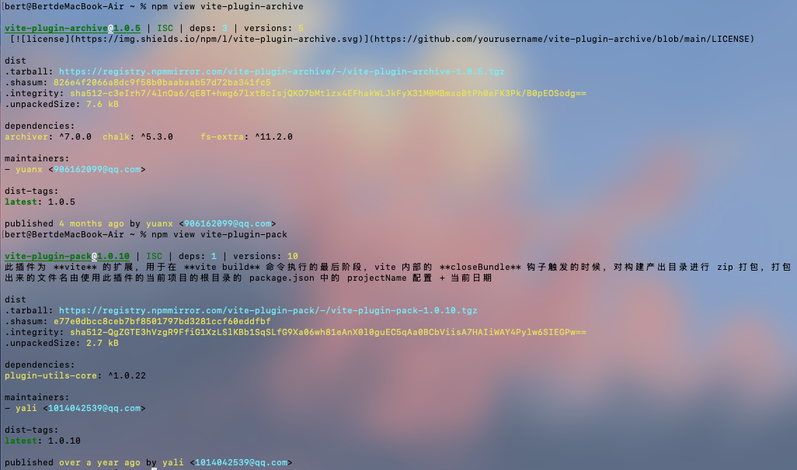
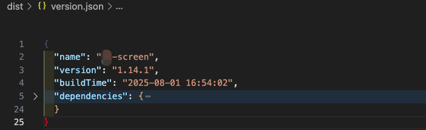

# vite-plugin-archive

一个自动打包 `dist` 目录并生成版本信息的 Vite 插件。

[](LICENSE)

目前没有发布到 npm 上，只能通过 git  clone 到本地使用，直接塞项目目录下。

因为写完，npm仓库一搜发现一堆类似功能的哈哈哈哈哈，根本没啥必要，除非后面丰富起来。


我在掘金上写了一篇笔记：
[B端项目版本同步方案：基于Vite插件的自动化实践](https://juejin.cn/spost/7533446102798008346)

## 功能特性

- 📦 自动将 `dist` 目录压缩为 zip/tar/tgz 格式
- 🏷️ 生成包含版本信息的 `version.json` 文件（其他关联项目可以fetch到）
- ⚡ 无缝集成到 Vite 构建流程
- 📊 显示实时压缩进度条
- 🔍 支持自定义包含/排除文件
- 🕒 自动记录构建时间

## 使用

下载到本地项目目录下，然后在 `vite.config.js` 中引入：

```js
import vitePluginArchive from "./vite-plugin-archive";

export default defineConfig(({ command, mode }) => {
  return {
    plugins: [
      vitePluginArchive({
        format: "zip", // 可选: 'zip' | 'tar' | 'tgz'
      }),
    ],
  };
});
```

build时，控制台显示如下：


完成后，显示如下：


最终，会在 `dist` 目录下生成 `version.json` 文件，包含版本信息。


